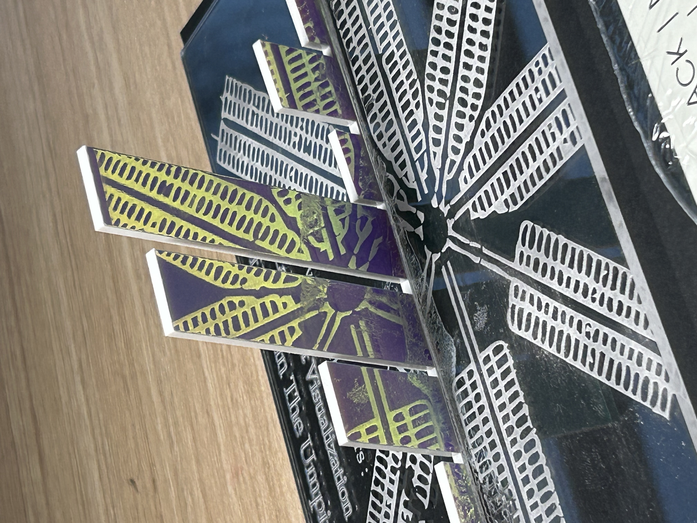

Over the past few weeks, my group collaborated to create a digital fabrication project that transformed data from The Umpire into a tangible, laser-cut product. Before this class, I had never had the opportunity to use a laser cutter, so this project presented a unique and exciting challenge for me and several of my group members. While I was eager to immerse myself in the creative aspects of the project, I also felt nervous because the concept was entirely new to me. Data is delicate, and it was crucial for our group to honor the message behind the data rather than reshaping it into something that simply looked visually appealing for the sake of the project. In this paper, I will discuss our creative process that led us to our final product: “Divinity Behind Bars: A Laser-Cut Visualization of Faith in the Umpire”.

Before our class visit to Eastern State Penitentiary, I had a general understanding of the brutal conditions and hopelessness endured by the inmates. My prior research on Eastern State shaped my perception of the harsh realities of prisoner experiences, but it left me questioning how these individuals managed to endure such conditions in the first place. As we examined the data in The Umpire, it was striking to see how prominently faith and religion appeared. Historically, communities facing immense suffering have often turned to faith as a source of hope and resilience during challenging times. The frequent references to religion in The Umpire deeply resonated with us, inspiring our group to center our laser-cut creation on this theme.

When we were assigning roles, I chose to take on the role of fabricator, a role that both challenged me and excited me. it was fascinating to see how our individual roles came together during the ideation process. Unfortunately, I couldn’t attend my group’s in-person brainstorming session, as the only time that worked for most of the team conflicted with my seminar class, despite our efforts to coordinate schedules. Even with this challenge, I was fortunate to be part of a team deeply committed to collaboration and creativity. I still was able to make a conscious effort to contribute and my group was understanding and accommodating of that. We shared ideas in our group chat, working together to design a product that honored the profound theme of religion in The Umpire. While there were frequent mentions of baseball in the data, which we considered as a potential direction, we ultimately decided to focus on a theme that felt more sensitive and meaningful. Religion holds a unique significance for everyone, and we were deliberate in capturing the themes that the incarcerated found deeply resonant, aiming to create something that truly respected and reflected their experiences.

Although I wasn’t able to attend our initial meeting, I made up for the lost time by collaborating extensively with some of my group members in the Education Commons. Our ideas flowed more naturally as we worked closely with the materials and machinery, deepening our understanding of the design process. During our discussions, we reached a consensus to use acrylic for our data visualization. Once we arrived, we discovered a stunning reflective and translucent acrylic that immediately sparked inspiration. The material allowed viewers to see their reflection, which we interpreted as a deeper metaphor: for many, religion serves as a way to look inward and focus on self-improvement. Similarly, gazing at our data creation invites viewers to see parts of themselves reflected back.

A significant portion of our success can be attributed to the mentorship and support provided by the Education Commons staff. They guided us through the creative process, offering valuable insights that helped refine and elevate our project. Their expertise and encouragement played a pivotal role in bringing our vision to life. With their help, we were able to use the laser cutter effectively and understand the inner workings of the machine more.

An interesting phenomenon emerged during our workshop: as we worked together, our roles became more fluid. Each of us contributed ideas and actively participated in the fabrication process, blurring the lines between our assigned titles. We found ourselves enjoying the collaborative process and problem-solving far more than we had anticipated. While this wasn’t a failure, one shortcoming was the limited time we had to work on our project in person, as Thanksgiving break fell between our sessions. Despite the constraints, we worked diligently to enhance our design to the best of our ability.

When we saw our histogram in person, we realized that adding a base would ground our piece and offer more opportunities to amplify the theme of religion from The Umpire. We chose a simple clear acrylic base that complemented rather than detracted from the vibrant design of our histogram. Incorporating the map of Eastern State as the base’s foundation added significant meaning—it symbolized how religion was deeply embedded in prison life, just as our histogram was physically supported by the base. Adding the title to the base was a thoughtful finishing touch that tied the project together.

However, adhering the two pieces turned out to be more challenging than we expected. We didn’t anticipate that the adhesive required—a chemical with hazardous fumes—would complicate the process. Despite the struggle, we gained valuable insights into the nuances of digital fabrication. Unfortunately, the pieces didn’t fit perfectly together, an issue that could have been resolved with just one more hour to refine our work. We also had an idea to slide an additional acrylic layer beneath the base to further stabilize the visualization, but time constraints ultimately influenced the outcome. Despite these challenges, the project was a meaningful learning experience that taught us both technical and creative problem-solving skills.

Overall, we collaborated effectively as a group, with each member contributing meaningfully to the final outcome of our data visualization. Reflecting on our process, a quote from Ratto’s piece on critical making resonated deeply with me: "Critical making emphasizes the shared acts of making rather than the evocative object. The final prototypes are not intended to be displayed and to speak for themselves. Instead, they are considered a means to an end, and achieve value through the act of shared construction, joint conversation, and reflection" (Ratto, 2011). This sentiment perfectly encapsulates our experience. By working together with a shared vision and leveraging our collective strengths, we surpassed our expectations and created something truly impactful. This project allowed our group to understand the value behind Digital Humanities work and empowered us to explore the intricacies of the field.

Ratto, M. (2011). Critical Making: Conceptual and Material Studies in Technology and Social Life. The Information Society, 27(4), 252–260. https://doi.org/10.1080/01972243.2011.583819

