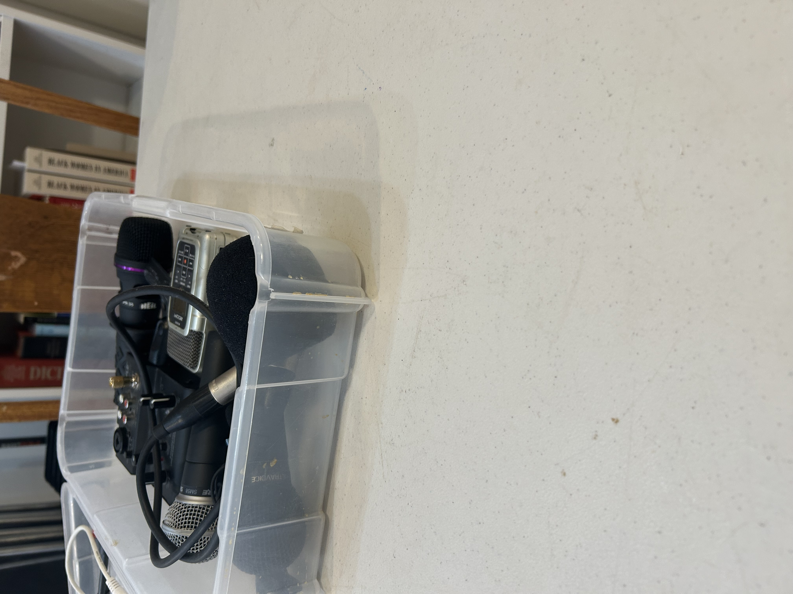

I attended a workshop at Iffy Books on audio recording basics, and it offered a unique experience compared to the workshop at Penn. Unlike the workshop at Penn Libraries, this was a small, in-person session, which made it feel more intimate and interactive. I also appreciated that Iffy Books provides free workshops to help people learn niche skills. It is such a cool resource that I might look into in the future!
Before this workshop, I was already interested in audio recording thanks to my experience with professional video cameras and microphones in my Video 1 class. In Video 1, I played around with visuals and sound to create unique narratives. I’d say that the audio editing in my videos had a lot of room for improvement, making this session much more useful. 
 However, this session gave me a new perspective on themes we've discussed in digital humanities. It was directly related in that recording audio represents a way to preserve a story digitally, an important aspect of archiving and storytelling in our fast-paced digital world. At the same time, it felt unrelated because none of our in-person class experiences have involved audio tools. I’ve really enjoyed the variety of resources I’ve been exposed to on campus and I wonder if maybe this class could play around with audio in the future. Despite the fact that it isn’t currently embedded in the course, this didn’t mean it wasn’t important to the digital humanities space. it just highlighted a different medium of preservation and communication that I hadn’t given much thought to prior to the workshop.
During the workshop, we downloaded and explored Audacity, a free, open-source audio editing software that became the centerpiece of our session. While I’ve used Adobe Premiere Pro to edit audio for video projects, working with Audacity made me realize just how extensively you can manipulate and tweak sound independently of video. Many of the other attendees were journalists seeking to enhance their skill sets, which offered a fascinating perspective on how audio tools are used across different fields. Others were just there for the sake of learning a new skill. The in person element of this workshop definitely added a different dimension to my learning as I got to hear anecdotes from others! It was more like a group discussion than just a workshop which I really appreciated.
One of the most hands-on and eye-opening parts of the workshop was experimenting with various microphones. Since the session was in person, we had the opportunity to test how microphone quality and price can drastically impact recording clarity. We also discussed how subtle factors, like the angle and distance of the microphone, can affect sound quality. This was especially interesting because I had assumed those details weren’t as critical as they turned out to be. A recurring theme throughout was the importance of preserving sound and maintaining the intended message, a concept that echoed the larger discussions about preserving important and potentially sensitive stories that have come up in class.
Ultimately, this workshop allowed me to engage with the concept of preservation from a fresh angle. I was able to understand the value of sound as a medium while broadening my technical knowledge in audio recording. I wonder if I will continue to use audacity in the future!

(I didn't take a selfie but here is some of the microphones we used!)
